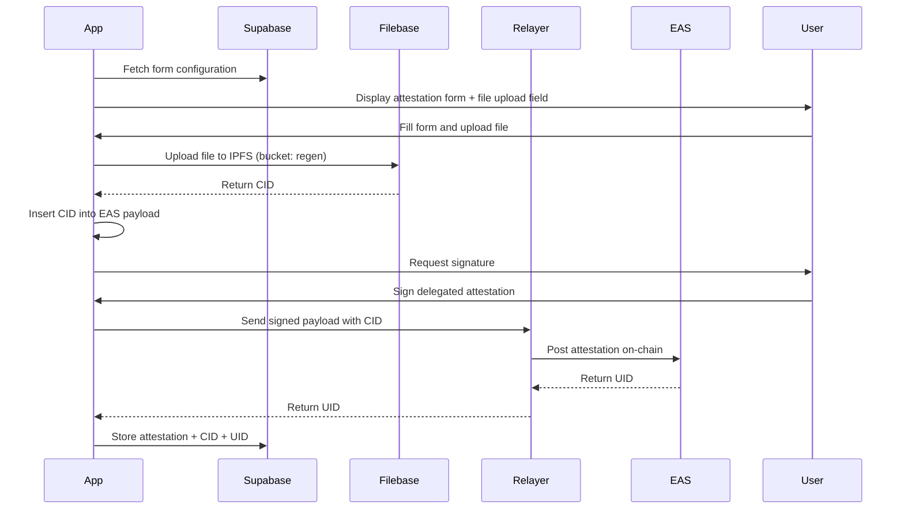

# 🌊 Coral Action Attestation v0.3 — Development Plan

**Version:** v0.3
**Author:** [Your Name]
**Last Updated:** October 18, 2025 (post-ship review)

---

## 🎯 Overview

This version expands the MVP by enabling **file uploads linked to attestations** using **IPFS storage via Filebase**, and introduces a **map visibility toggle** for attestation filtering.

---

## 🧩 New Features

### 1️⃣ File Upload Integration (IPFS via Filebase)

* Users can now attach a file (e.g., restoration image, field data, PDF, or research proof) to their attestation submission.
* Uploaded files will be stored in **Filebase** (bucket: `regen`), which provides IPFS-compatible storage.
* The app will also save a **gateway URL** in the database so viewers can open files directly from profiles or the map without navigating through EAS.

#### Updated EAS Schema

A new field will be added to store the **CID** of the uploaded file:

| Field     | Type   | Description                                    |
| --------- | ------ | ---------------------------------------------- |
| `fileCID` | string | IPFS CID for uploaded file stored via Filebase |

#### Updated Submission Flow

1. User fills the attestation form.
2. User selects and uploads a file (optional).
3. Frontend uploads file to Filebase via API in the background.
4. Upon upload completion, app retrieves **CID** from Filebase and constructs a **gateway URL** using the configured gateway.
5. CID and gateway URL are injected into the EAS schema payload (CID on-chain; URL off-chain in DB).
6. User signs delegated message.
7. Relayer submits the attestation on-chain.
8. Supabase stores attestation data including **file_cid**, **file_gateway_url**, and **uid**.

**Purpose:**
This ensures each attestation can reference verifiable evidence of restoration work (on-chain CID) while giving users a direct, simple link to view the file (gateway URL) from the UI.

---

### 2️⃣ Map Visibility Control

Add a new boolean column to the `attestations` table:

| Column        | Type    | Default | Description                                        |
| ------------- | ------- | ------- | -------------------------------------------------- |
| `show_on_map` | boolean | true    | Controls whether attestation appears on public map |

**Reasoning:**
This feature allows the team to hide test submissions or incomplete entries from the public map, ensuring that only validated coral restoration efforts are displayed. It supports internal testing and quality control without affecting the public dataset.

---

## 🗄️ Database Schema Changes (Supabase)

### Modify `attestations` Table

Add the following columns:

```sql
ALTER TABLE attestations
ADD COLUMN file_cid TEXT,
ADD COLUMN file_gateway_url TEXT,
ADD COLUMN show_on_map BOOLEAN DEFAULT TRUE;
```

**Notes**

* `file_cid`: raw IPFS content identifier returned by Filebase after upload.
* `file_gateway_url`: a pre-built, user-ready URL to open the file directly via a configured gateway (e.g., `{gateway}/ipfs/{cid}`); stored to avoid recomputing or coupling UI to EAS reads.
* `show_on_map`: controls public visibility on the map.

---

## ⚙️ Updated Workflow



---

## 🗓️ Development Phases & Tasks

### **Phase 1 — Schema & Infrastructure (Week 1)**

* [x] Deploy updated EAS schema including `fileCID`.
* [x] Add new columns in Supabase: `file_cid`, `file_gateway_url`, `show_on_map`.
* [x] Setup Filebase credentials and bucket (`regen`).
* [x] Implement server util to generate gateway URL from CID (configurable base gateway).
* [x] Test Filebase upload API (signed requests).

### **Phase 2 — Frontend Integration (Week 2)**

* [x] Add file upload UI to attestation form (image/PDF).
* [x] Upload to Filebase; on success, capture CID and compute gateway URL.
* [x] Auto-fill CID into EAS payload; persist gateway URL in DB record.
* [x] Show upload progress, success, and error states.

### **Phase 3 — Relayer & EAS Update (Week 3)**

* [x] Update relayer to accept payloads that include `fileCID` (ignore gateway URL). (Schema-agnostic; no code change required.)
* [x] Confirm EAS typed data with `fileCID` passes validation.
* [x] End-to-end test: form → upload → sign → relayer → on-chain; DB stores URL.

### **Phase 4 — Map & Profiles (Week 4)**

* [x] `/map` only displays `show_on_map = TRUE`.
* [x] Profile and map popovers show a "View file" link if `file_gateway_url` present.
* [ ] Admin/Supabase UI toggle for `show_on_map` per attestation. (Manual toggle in DB for now.)

### **Phase 5 — QA & Deployment (Week 5)**

* [x] Verify gateway links open correctly across devices.
* [x] Verify IPFS retrieval via CID and via gateway URL.
* [x] Deploy updated relayer and Next.js app.

---

## 🔮 Future Considerations (v0.4+)

* Add file type validation and size limit enforcement.
* Support multiple file uploads per attestation.
* Display file previews or download links on profile and map popups.
* IPFS pinning strategy for data longevity.
* Verified attestation media badge (with checksum validation).

---

**End of Document**
